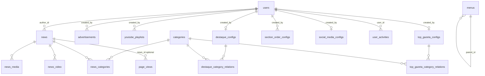

# Banco de dados Gazeta — inventário para migração

Documento gerado a partir do **Prisma** (`prisma/schema.prisma`) como fonte da verdade do schema **atual** em produção/desenvolvimento. Use este arquivo para comparar com a nova versão (novo schema, outro SGBD ou ORM) e planejar migração **sem perda de dados**.

---

## 1. Contexto técnico

| Item | Valor |
|------|--------|
| SGBD | **MySQL** |
| Charset típico das migrações iniciais | `utf8mb4` / `utf8mb4_unicode_ci` |
| ORM / definição do schema | **Prisma** (`provider = "mysql"`) |
| URL de conexão | variável de ambiente `DATABASE_URL` |
| Cliente gerado | `apps/backend-gazeta/generated/prisma` |

**Arquivos relacionados**

- Schema: `apps/backend-gazeta/prisma/schema.prisma`
- Histórico de alterações SQL: `apps/backend-gazeta/prisma/migrations/` (várias pastas datadas)

**Conteúdo fora do banco (não esquecer na migração)**

- Uploads servidos em `/uploads/` vêm do diretório de trabalho do processo, em geral `apps/backend-gazeta/uploads` (paths referenciados em `media`/`advertisements`/`news` costumam ser URLs ou caminhos — valide no código e no disco).

---

## 2. Inventário de tabelas (nome físico MySQL)

Todas as tabelas abaixo são mapeadas via `@@map` no Prisma. Total: **19 tabelas**.

| # | Tabela MySQL | Modelo Prisma | Função resumida |
|---|----------------|---------------|-----------------|
| 1 | `users` | `User` | Usuários / autores |
| 2 | `categories` | `Category` | Categorias de notícias |
| 3 | `news` | `News` | Notícias |
| 4 | `news_media` | `NewsMedia` | Mídias ligadas a uma notícia |
| 5 | `news_video` | `NewsVideo` | Vídeos (URL) ligados a uma notícia |
| 6 | `news_categories` | `NewsCategory` | N:N notícia ↔ categoria |
| 7 | `media` | `Media` | Registros de mídia globais (sem FK para news no schema) |
| 8 | `videos` | `Video` | Vídeos cadastrados (entidade própria) |
| 9 | `advertisements` | `Advertisement` | Anúncios / banners |
| 10 | `destaque_configs` | `DestaqueConfig` | Config “destaques” da home |
| 11 | `destaque_category_relations` | `DestaqueCategoryRelation` | N:N destaque ↔ categorias |
| 12 | `top_gazeta_configs` | `TopGazetaConfig` | Config “top gazeta” |
| 13 | `top_gazeta_category_relations` | `TopGazetaCategoryRelation` | N:N top gazeta ↔ categorias |
| 14 | `section_order_configs` | `SectionOrderConfig` | Ordem/título das seções da home |
| 15 | `social_media_configs` | `SocialMediaConfig` | Links de redes sociais |
| 16 | `menus` | `Menu` | Itens de menu (árvore `parent_id`) |
| 17 | `youtube_playlists` | `YoutubePlaylist` | Itens da playlist YouTube |
| 18 | `page_views` | `PageView` | Analytics — visualizações de página |
| 19 | `user_activities` | `UserActivity` | Analytics — atividades de usuários |

---

## 3. Detalhamento por tabela

Convenções: PK = chave primária; FK = chave estrangeira; `?` = opcional no Prisma (`nullable`).

### 3.1 `users`

| Coluna | Tipo lógico | Restrições / notas |
|--------|-------------|-------------------|
| `id` | Int, autoincrement | PK |
| `email` | String | **UNIQUE** |
| `password` | String | hash armazenado |
| `name` | String | |
| `created_at` | DateTime | default `now()` |
| `updated_at` | DateTime | atualizado automaticamente |

**Relações:** referenciado por `news.author_id`, `advertisements.created_by`, `youtube_playlists.created_by`, configs (`created_by`), `user_activities.user_id`.

---

### 3.2 `categories`

| Coluna | Tipo lógico | Restrições / notas |
|--------|-------------|-------------------|
| `id` | Int, AI | PK |
| `name` | String | **UNIQUE** |
| `description` | Text? | |
| `slug` | String | **UNIQUE** |
| `color` | VarChar(20)? | |
| `is_active` | Boolean | default `true` |
| `created_at` | DateTime | default `now()` |
| `updated_at` | DateTime | `@updatedAt` |

**Relações:** `news_categories`, `destaque_category_relations`, `top_gazeta_category_relations`.

---

### 3.3 `news`

| Coluna | Tipo lógico | Restrições / notas |
|--------|-------------|-------------------|
| `id` | Int, AI | PK |
| `title` | VarChar(255) | |
| `subtitle` | Text | |
| `content` | LongText | corpo principal |
| `author` | VarChar(200) | texto (legado); autor “oficial” é `author_id` → `users` |
| `published` | VarChar(50) | default `"false"` — **enum lógico em string** |
| `views` | Int | default `0` |
| `status` | VarChar(50) | default `"ACTIVE"` — **enum lógico** |
| `validity` | VarChar(50)? | |
| `slug` | VarChar(255) | **UNIQUE** |
| `is_emphasis` | Boolean | default `false` |
| `created_at` | DateTime | default `now()` |
| `update_at` | DateTime | `@updatedAt` (nome de coluna **update_at**, não `updated_at`) |
| `author_id` | Int | FK → `users.id`, index `news_author_id_fkey` |

**Relações:** `news_categories`, `news_media`, `news_video`, `page_views` (opcional).

**⚠ Migração:** preservar `slug` único, `author_id` válido e mapear valores de `status` / `published` para o novo modelo (strings livres).

---

### 3.4 `news_media`

| Coluna | Tipo lógico | Restrições / notas |
|--------|-------------|-------------------|
| `id` | Int, AI | PK |
| `emphasis` | Boolean | default `false` |
| `img_size` | Json? | metadados de tamanho |
| `author` | VarChar(200)? | |
| `date` | VarChar(50)? | |
| `news_id` | Int | FK → `news.id`, **ON DELETE CASCADE** |

**Índice:** `news_media_news_id_fkey`.

---

### 3.5 `news_video`

| Coluna | Tipo lógico | Restrições / notas |
|--------|-------------|-------------------|
| `id` | Int, AI | PK |
| `url` | VarChar(500) | |
| `thumbnail` | VarChar(500) | |
| `news_id` | Int | FK → `news.id`, **ON DELETE CASCADE** |

---

### 3.6 `news_categories` (tabela de junção)

| Coluna | Tipo | Restrições |
|--------|------|-------------|
| `news_id` | Int | FK → `news.id`, **ON DELETE CASCADE**, parte da PK composta |
| `category_id` | Int | FK → `categories.id`, **ON DELETE CASCADE**, parte da PK composta |

**PK composta:** (`news_id`, `category_id`).  
**Índice:** `news_categories_category_id_fkey` em `category_id`.

---

### 3.7 `media`

| Coluna | Tipo lógico | Restrições / notas |
|--------|-------------|-------------------|
| `id` | Int, AI | PK |
| `emphasis` | Boolean | default `false` |
| `img_size` | Json? | |
| `author` | VarChar(200)? | |
| `date` | VarChar(50)? | |
| `created_at` | DateTime | default `now()` |
| `updated_at` | DateTime | `@updatedAt` |

**Sem FK no schema** — registros independentes; na migração, conferir como o app associa arquivos a notícias (pode ser só por convenção de API).

---

### 3.8 `videos`

| Coluna | Tipo lógico | Restrições / notas |
|--------|-------------|-------------------|
| `id` | Int, AI | PK |
| `title` | VarChar(255) | |
| `url` | VarChar(500) | |
| `thumbnail` | VarChar(500)? | |
| `duration` | VarChar(20)? | formato livre (ex.: MM:SS) |
| `created_at` | DateTime | default `now()` |
| `updated_at` | DateTime | `@updatedAt` |

**Sem FK** no schema atual.

---

### 3.9 `advertisements`

| Coluna | Tipo lógico | Restrições / notas |
|--------|-------------|-------------------|
| `id` | Int, AI | PK |
| `title` | VarChar(255) | |
| `description` | Text? | |
| `image_url` | VarChar(500) | |
| `click_url` | VarChar(500)? | |
| `position` | VarChar(100) | ex.: top, sidebar |
| `placement` | VarChar(50) | ex.: home, news |
| `size` | VarChar(20) | default `"728x90"` |
| `is_active` | Boolean | default `true` |
| `priority` | Int | default `0` |
| `start_date` | DateTime? | |
| `end_date` | DateTime? | |
| `created_at` | DateTime | default `now()` |
| `updated_at` | DateTime | `@updatedAt` |
| `created_by` | Int | FK → `users.id` |

**Índices:** `advertisement_created_by_fkey`; composto `(placement, position, is_active)` → `advertisement_placement_position_active_idx`.

---

### 3.10 `destaque_configs`

| Coluna | Tipo lógico | Restrições / notas |
|--------|-------------|-------------------|
| `id` | Int, AI | PK |
| `random_mode` | Boolean | default `false` |
| `created_at` / `updated_at` | DateTime | |
| `created_by` | Int | **UNIQUE**, FK → `users.id` — **no máximo um registro “por criador” no desenho atual** |

**Relações:** filhas em `destaque_category_relations`.

---

### 3.11 `destaque_category_relations`

| Coluna | Tipo | Restrições |
|--------|------|------------|
| `id` | Int, AI | PK |
| `destaque_config_id` | Int | FK → `destaque_configs.id`, **ON DELETE CASCADE** |
| `category_id` | Int | FK → `categories.id`, **ON DELETE CASCADE** |

**UNIQUE** (`destaque_config_id`, `category_id`). Índices em ambas as FKs.

---

### 3.12 `top_gazeta_configs`

Igual em estrutura a `destaque_configs`: `random_mode`, timestamps, `created_by` **UNIQUE** → `users`.

---

### 3.13 `top_gazeta_category_relations`

| Coluna | Tipo | Restrições |
|--------|------|------------|
| `id` | Int, AI | PK |
| `top_gazeta_config_id` | Int | FK → `top_gazeta_configs.id`, **CASCADE** |
| `category_id` | Int | FK → `categories.id`, **CASCADE** |

**UNIQUE** (`top_gazeta_config_id`, `category_id`).

---

### 3.14 `section_order_configs`

| Coluna | Tipo lógico | Restrições / notas |
|--------|-------------|-------------------|
| `id` | Int, AI | PK |
| `section_id` | VarChar(50) | identificador lógico (carousel, videos, …) — **UNIQUE** |
| `name` | VarChar(100) | |
| `title` | VarChar(200) | |
| `order` | Int | **UNIQUE** global (uma linha por ordem) |
| `show_title` | Boolean | default `true` |
| `icon` | VarChar(50)? | |
| `created_at` / `updated_at` | DateTime | |
| `created_by` | Int | FK → `users.id` |

**Índice:** `order`.

---

### 3.15 `social_media_configs`

| Coluna | Tipo | Notas |
|--------|------|--------|
| `id` | Int, AI | PK |
| `instagram`, `facebook`, `youtube`, `linkedin`, `twitter`, `tiktok` | VarChar(500)? | |
| `whatsapp` | VarChar(50)? | |
| `created_at` / `updated_at` | DateTime | |
| `created_by` | Int | **UNIQUE**, FK → `users.id` |

---

### 3.16 `menus`

| Coluna | Tipo lógico | Restrições / notas |
|--------|-------------|-------------------|
| `id` | Int, AI | PK |
| `order` | Int? | pode ser nulo |
| `name` | VarChar(255) | |
| `type` | VarChar(50) | |
| `slug` | VarChar(255)? | |
| `router_link` | VarChar(500)? | |
| `external_link` | VarChar(500)? | |
| `parent_id` | Int? | FK → `menus.id`, **ON DELETE CASCADE** (árvore) |
| `is_active` | Boolean | default `true` |
| `created_at` / `updated_at` | DateTime | |

**Índices:** `(order, is_active)`; `parent_id`.

---

### 3.17 `youtube_playlists`

| Coluna | Tipo lógico | Restrições / notas |
|--------|-------------|-------------------|
| `id` | Int, AI | PK |
| `title` | VarChar(255) | |
| `description` | Text? | |
| `youtube_url` | VarChar(500) | |
| `thumbnail` | VarChar(500)? | |
| `duration` | VarChar(20)? | |
| `video_id` | VarChar(50) | ID YouTube |
| `display_order` | Int | **UNIQUE** (`youtube_playlist_order_unique`) |
| `is_active` | Boolean | default `true` |
| `is_emphasis` | Boolean | default `false` |
| `published_at` | DateTime? | |
| `created_at` / `updated_at` | DateTime | |
| `created_by` | Int | FK → `users.id` |

**Índices:** `(display_order, is_active)`; `created_by`.

---

### 3.18 `page_views`

| Coluna | Tipo lógico | Restrições / notas |
|--------|-------------|-------------------|
| `id` | Int, AI | PK |
| `news_id` | Int? | FK → `news.id`, **ON DELETE SET NULL** |
| `path` | VarChar(500) | |
| `user_agent` | Text? | |
| `ip_address` | VarChar(45)? | IPv6 |
| `referer` | VarChar(500)? | |
| `session_id` | VarChar(255)? | |
| `duration` | Int? | segundos |
| `device_type` | VarChar(20)? | |
| `browser` | VarChar(50)? | |
| `os` | VarChar(50)? | |
| `country` | VarChar(100)? | |
| `city` | VarChar(100)? | |
| `created_at` | DateTime | default `now()` |

**Índices:** `news_id`; `created_at`; `(path, created_at)`.

**Volume:** tabela de analytics — pode crescer muito; na migração, planejar cópia em lotes ou janela de manutenção.

---

### 3.19 `user_activities`

| Coluna | Tipo lógico | Restrições / notas |
|--------|-------------|-------------------|
| `id` | Int, AI | PK |
| `user_id` | Int | FK → `users.id`, **ON DELETE CASCADE** |
| `action` | VarChar(100) | ex.: login, create_news |
| `entity_type` | VarChar(50)? | |
| `entity_id` | Int? | |
| `description` | Text? | |
| `ip_address` | VarChar(45)? | |
| `user_agent` | Text? | |
| `created_at` | DateTime | default `now()` |

**Índices:** `user_id`; `created_at`; `(action, created_at)`.

---

## 4. Mapa de relacionamentos (referência rápida)

```
users
  ├── news (author_id)
  ├── advertisements (created_by)
  ├── youtube_playlists (created_by)
  ├── destaque_configs (created_by, 1:1)
  ├── top_gazeta_configs (created_by, 1:1)
  ├── section_order_configs (created_by)
  ├── social_media_configs (created_by, 1:1)
  └── user_activities (user_id, CASCADE delete)

categories
  ├── news_categories → news
  ├── destaque_category_relations → destaque_configs
  └── top_gazeta_category_relations → top_gazeta_configs

news
  ├── news_categories → categories
  ├── news_media (CASCADE)
  ├── news_video (CASCADE)
  └── page_views (SET NULL on delete news)

menus
  └── parent_id → menus (self, CASCADE)
```

**Tabelas sem FK no schema:** `media`, `videos`.

---

## 5. Comportamentos de integridade (ON DELETE)

| De / Para | Comportamento |
|-----------|----------------|
| `news` → `news_media`, `news_video`, `news_categories` | **CASCADE** (apagar notícia remove junções e filhos) |
| `news` → `page_views` | **SET NULL** em `news_id` |
| `users` → `user_activities` | **CASCADE** |
| `categories` → tabelas de junção destaque/top | **CASCADE** |
| `destaque_configs` / `top_gazeta_configs` → relações N:N | **CASCADE** |
| `menus` → `menus` (filho) | **CASCADE** |

Na nova versão, replique ou documente mudanças explícitas (ex.: passar de CASCADE para RESTRICT altera o que acontece ao excluir notícias).

---

## 6. Checklist para migração sem perda de dados

1. **Exportar dump lógico** do MySQL atual (`mysqldump` com `--single-transaction` se InnoDB, ou backup nativo).
2. **Contar linhas** por tabela antes/depois na base nova (`SELECT COUNT(*)`) — especialmente `page_views`, `news`, `news_media`, `user_activities`.
3. **Validar FKs** após import: ordem sugerida — `users` → `categories` → `news` → junções e filhos → configs → analytics.
4. **Preservar unicidades:** `users.email`, `categories.name`, `categories.slug`, `news.slug`, `youtube_playlists.display_order`, `section_order_configs.section_id` e `section_order_configs.order`, configs `created_by` únicos.
5. **Campos string-sem-enum:** mapear todos os valores distintos de `news.status`, `news.published`, `menus.type`, `advertisement.position/placement` na base antiga e cruzar com o novo modelo.
6. **Coluna `news.update_at`:** nome divergente de `updated_at` — scripts ETL devem usar o nome físico correto.
7. **Arquivos estáticos:** copiar `uploads` e garantir que URLs no banco continuem válidas (ou rodar script de substituição de base URL).
8. **Prisma na nova versão:** gerar diff (`prisma migrate diff`) entre schema antigo e novo; evitar `db push` cego em produção.

---

## 7. Diagrama ER (visão simplificada)



---

## 8. Histórico de migrações Prisma (pastas em `prisma/migrations/`)

Use a ordem aplicada pelo Prisma (conforme `_prisma_migrations` no banco). Pastas presentes no repositório (referência de evolução):

- `20250526233029_init`
- `20250601145338_add_categories_table`
- `20250603233148_add_news_and_news_categories_tables`
- `20250614140709_add_media_table`
- `20250619191212_add_advertisement_table`
- `20250619195114_add_home_category_config`
- `20250621150837_make_validity_optional`
- `20250101000000_add_menu_table`
- `20250718172230_add_youtube_playlist`
- `20250718173740_make_thumbnail_optional`
- `20251020225316_add_video_table`
- `20251020235758_add_color_to_categories`
- `20251103155836_add_menu_parent_relationship`
- `20251103160903_add_parent_id_to_menu`
- `20251116143529_add_analytics_tables`
- `20251117201304_make_menu_order_nullable`
- `20251117211910_add_size_to_advertisement`
- `20251119175908_refactor_config_system`

---

## 9. Próximos passos sugeridos para “diff” com a nova versão

1. Colar lado a lado: este documento × novo `schema.prisma` ou DDL alvo.
2. Marcar: tabelas removidas, renomeadas, colunas novas/obsoletas, mudança de tipo (ex.: `String` → enum real).
3. Para cada mudança: script de **transformação** (SQL ou job ETL) + teste em cópia do dump.
4. Registrar valores de negócio em strings (`status`, `published`) em uma tabela auxiliar de mapeamento na documentação da nova versão.

---

*Documento alinhado ao `schema.prisma` do repositório na data de geração. Após alterações no schema, regenere ou atualize as seções 2–3 manualmente.*
